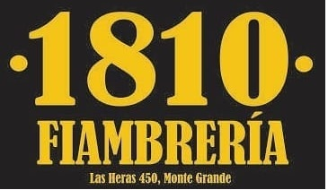

<!DOCTYPE html PUBLIC "-//W3C//DTD XHTML 1.0 Transitional//EN" "http://www.w3.org/TR/xhtml1/DTD/xhtml1-transitional.dtd">
<html xmlns="http://www.w3.org/1999/xhtml">
<head>
<meta http-equiv="Content-Type" content="text/html; charset=utf-8" />
<title>Documento sin título</title>
<link href="thrColLiqHdr.css" rel="stylesheet" type="text/css" /><!--[if lte IE 7]>

<![endif]-->
</head>

<body>

  
 
    <!-- end .header -->

  

    <ul class="nav">
      <li>
        
Productos

      </li>
      <li>
        
<a href="promociones.html">Promociones</a>

      </li>
      <li>
        
<a href="picadas.html">Picadas</a>

      </li>
      <li>
        
<a href="#">Pedidos</a>

      </li>
    </ul>
    
&nbsp;

    <!-- end .sidebar1 -->

  

    <h1>Nosotros</h1>
    
Aca vas a encontrar la mejor longaniza que te podes comer, entera, en cubo o fileteada, te va a encantar. Además tenemos quesos y otros tipos de fiambres.

    <h2>Otras Sustancias</h2>
    
Tambien contamos con mercaderia de almacen, helados grido y bebidas frescas frescas, ricas ricas.

    <h3>Medios de Pago</h3>
    
Podes pagar con efectivo, debito, credito ( entregando las nalgas) y en especias.. vos elegis

    
cualquier duda consulta con tu medico de confianza.

    <!-- end .content -->

  

    <h4>Imagenes del almacen</h4>
    <!-- end .sidebar2 -->

  

    
Y si no te gusta comprate una pizza y no rompas las bolas.

    <!-- end .footer -->

  <!-- end .container -->

</body>
</html>
